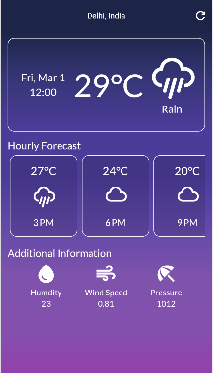
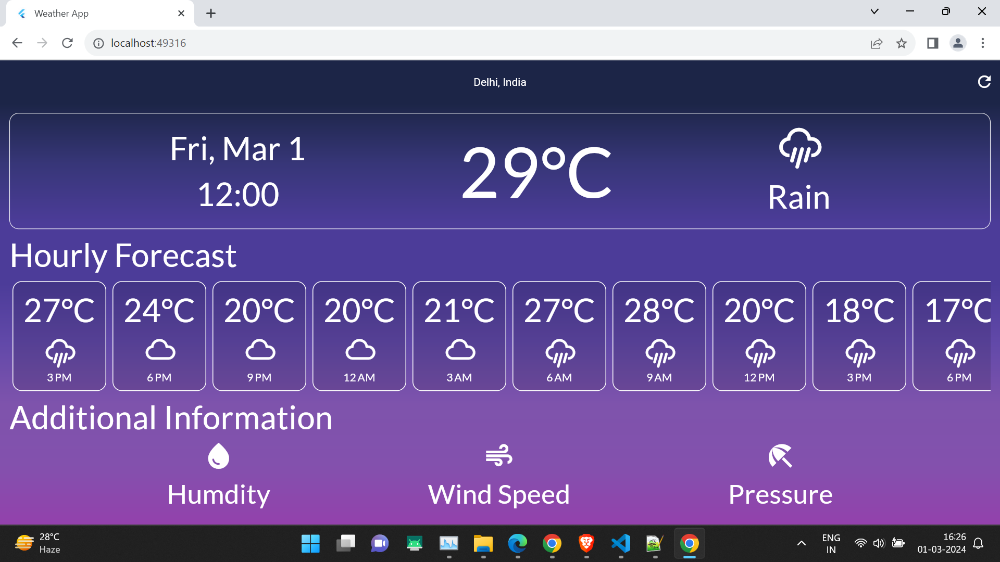

# Responsive Weather App

Welcome to the Responsive Weather App – a powerful and intuitive Flutter application designed to provide you with accurate weather information on the go. This app leverages cutting-edge technologies, including the Bloc state management pattern, freezed for immutable data structures, and auto_route for seamless navigation.

## Features

- **Bloc Architecture:** Benefit from a robust and scalable architecture that simplifies state management and enhances code organization.
  
- **Immutable Data Structures:** Utilize freezed to create immutable data structures, promoting cleaner code and reducing the likelihood of bugs.

- **Dynamic Navigation:** Navigate through the app seamlessly with auto_route, a powerful package that simplifies routing in Flutter and ensures a smooth user experience.

- **Responsive Design:** Experience a responsive design that adapts to various screen sizes, providing an optimal viewing experience on both mobile devices and tablets.

